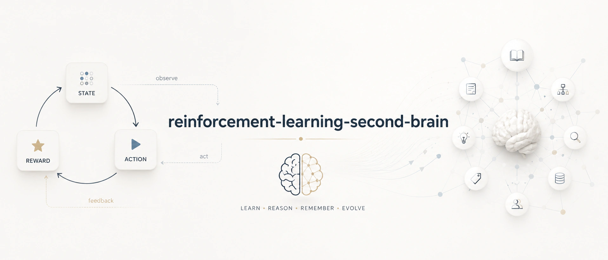
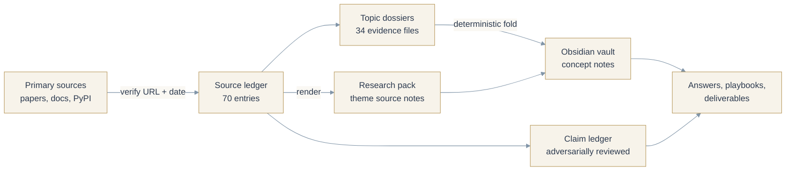
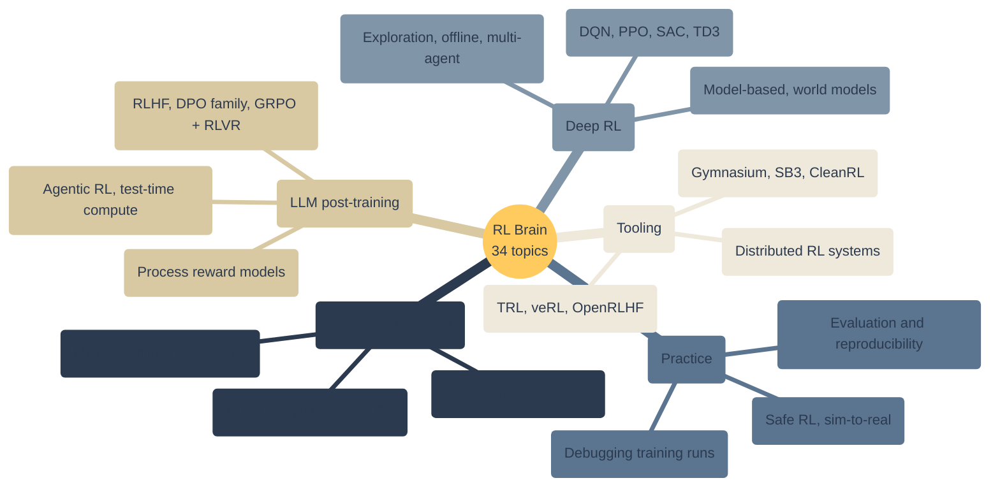

# Reinforcement Learning Brain

<p align="center">
  
</p>

A second brain for reinforcement learning that you can actually trust. Every claim traces to a dated primary source, every source has a refresh date, and the whole thing is an Obsidian vault your AI agents can read and operate.

It covers the full arc of RL: the classic foundations (MDPs, Q-learning, policy gradients, PPO, SAC), the frontier that ships today (RLHF, DPO, GRPO, RL with verifiable rewards, agentic multi-turn RL, world models, test-time compute), and the practice in between (debugging training runs, evaluation pitfalls, safe RL, the tooling landscape).

**Current maturity:** market-ready. Brainstein audit 100/100 with zero critical failures, coach grade SSS+, 34 topic dossiers, 70-source verified ledger, refreshed monthly.

It ships two artifacts:

- `assets/template-brain/` - the distributable Obsidian vault.
- `SKILL.md` plus `scripts/` - the agent-facing operating layer.

## How It Works

Knowledge flows from verified sources to answers you can cite:



The 34 topics span five curated themes:



The repo also ships working adapters: feed it a training-run export and it flags entropy collapse, KL spikes, and reward collapse with citations back to the debugging canon:

```mermaid
%%{init: {"theme": "base", "themeVariables": {
  "background": "#faf8f3",
  "primaryColor": "#f7f3ea",
  "primaryTextColor": "#2c3a4f",
  "primaryBorderColor": "#b99a5f",
  "lineColor": "#8195a8",
  "secondaryColor": "#efe9db",
  "tertiaryColor": "#faf8f3",
  "edgeLabelBackground": "#faf8f3",
  "fontFamily": "Segoe UI, Helvetica, Arial, sans-serif"
}}}%%
flowchart LR
    A["Training run<br/>CSV or W&B JSON"] --> B["import_training_run.py<br/>validate + normalize"]
    B --> C["synthesize_training_run.py<br/>detect failure patterns"]
    C --> D["render_training_run_report.py<br/>markdown health report"]
    D --> E["Findings cite<br/>references/topics/023"]
```



## Buyer

ML engineers, researchers, and AI builders who need repeatable, source-cited reinforcement learning decisions, from classic RL through modern LLM post-training.

## Outputs

- Algorithm selection guide
- RLHF / post-training pipeline playbook
- Debugging and reproducibility checklist
- Evaluation and benchmark scorecard
- Weekly research-refresh report

## Quick Start

```bash
python -m pip install -e .
reinforcement-learning-brain demo
reinforcement-learning-brain lint --vault examples/sample-vault
reinforcement-learning-brain report --vault examples/sample-vault --html-only
```

To create a client vault:

```bash
reinforcement-learning-brain new acme --client-name "Acme Co" --owner "Daniel Agrici" --out-dir ~/reinforcement-learning-brain-vaults
reinforcement-learning-brain ingest --vault ~/reinforcement-learning-brain-vaults/acme --file tests/fixtures/sample-source.md
reinforcement-learning-brain synthesize --vault ~/reinforcement-learning-brain-vaults/acme
reinforcement-learning-brain visuals --vault ~/reinforcement-learning-brain-vaults/acme
reinforcement-learning-brain report --vault ~/reinforcement-learning-brain-vaults/acme --html-only
reinforcement-learning-brain next --vault ~/reinforcement-learning-brain-vaults/acme
```

## Boundaries

V1 is advisory and read-only. It does not mutate accounts, systems, books,
pipelines, publishing tools, customer records, or live production data.

Domain claims are release-blocked until `references/current-requirements.md`,
`references/market-research.md`, `references/source-map.md`, and
`references/source-ledger.json` contain dated source material from trustworthy
sources.

## Maturity Gates

1. Scaffolded: product shell, vault, source pack, scripts, tests, and demo exist.
2. Researched: dated trustworthy sources replace placeholder research.
3. Domain-adapted: real domain importer, synthesis, reports, fixtures, and tests exist.
4. Demo-verified: sample vault regenerates deterministically and reports cite sources.
5. Market-ready: audit score is at least 90 with no critical failures.

Scores are capped by maturity. A scaffold cannot become market-ready by edited
markdown alone.

## Research Policy

Use official, primary, or vendor documentation first. Use market or practitioner
sources only as supporting evidence. Do not treat blog roundups or AI summaries
as primary truth. Record evidence in `references/source-ledger.json`; prose-only
research notes do not satisfy the gate.

## Release

```bash
python scripts/package_release.py --version 1.1.0
python scripts/package_release.py --version 1.1.0 --release-type market-ready
```

Release packaging scans for secrets, local paths, symlinks, untracked drift,
and unsafe ZIP entries before writing `dist/RELEASE_MANIFEST.json` and
`dist/SHA256SUMS`. Market-ready packaging also runs `scripts/audit_brain.py`.

## Community

- [AI Marketing Hub Pro on Skool](https://www.skool.com/ai-marketing-hub-pro) - join to get support, updates, and the full library of AI brains and workflows this brain is built with.
- [AI Marketing Hub on Skool](https://www.skool.com/ai-marketing-hub) - free community.
- [GitHub Issues](https://github.com/AgriciDaniel/reinforcement-learning-second-brain/issues) - bugs and feature requests.
