# Reinforcement Learning Brain

<p align="center">
  
</p>

Reinforcement Learning Brain is an evidence-gated Obsidian brain for reinforcement learning: fundamentals, deep RL, RLHF/RLAIF and preference optimization, evaluation, tooling, and applied best practices.

**Current maturity:** scaffolded. This repo is not market-ready until research,
domain adapters, demo verification, audit, and release gates pass.

It ships two artifacts:

- `assets/template-brain/` - the distributable Obsidian vault.
- `SKILL.md` plus `scripts/` - the agent-facing operating layer.

## Buyer

ML engineers, researchers, and AI builders who need repeatable, source-cited reinforcement learning decisions, from classic RL through modern LLM post-training.

## Outputs

- Algorithm selection guide
- RLHF / post-training pipeline playbook
- Debugging and reproducibility checklist
- Evaluation and benchmark scorecard
- Weekly research-refresh report

## Quick Start

```bash
python -m pip install -e .
reinforcement-learning-brain demo
reinforcement-learning-brain lint --vault examples/sample-vault
reinforcement-learning-brain report --vault examples/sample-vault --html-only
```

To create a client vault:

```bash
reinforcement-learning-brain new acme --client-name "Acme Co" --owner "Daniel Agrici" --out-dir ~/reinforcement-learning-brain-vaults
reinforcement-learning-brain ingest --vault ~/reinforcement-learning-brain-vaults/acme --file tests/fixtures/sample-source.md
reinforcement-learning-brain synthesize --vault ~/reinforcement-learning-brain-vaults/acme
reinforcement-learning-brain visuals --vault ~/reinforcement-learning-brain-vaults/acme
reinforcement-learning-brain report --vault ~/reinforcement-learning-brain-vaults/acme --html-only
reinforcement-learning-brain next --vault ~/reinforcement-learning-brain-vaults/acme
```

## Boundaries

V1 is advisory and read-only. It does not mutate accounts, systems, books,
pipelines, publishing tools, customer records, or live production data.

Domain claims are release-blocked until `references/current-requirements.md`,
`references/market-research.md`, `references/source-map.md`, and
`references/source-ledger.json` contain dated source material from trustworthy
sources.

## Maturity Gates

1. Scaffolded: product shell, vault, source pack, scripts, tests, and demo exist.
2. Researched: dated trustworthy sources replace placeholder research.
3. Domain-adapted: real domain importer, synthesis, reports, fixtures, and tests exist.
4. Demo-verified: sample vault regenerates deterministically and reports cite sources.
5. Market-ready: audit score is at least 90 with no critical failures.

Scores are capped by maturity. A scaffold cannot become market-ready by edited
markdown alone.

## Research Policy

Use official, primary, or vendor documentation first. Use market or practitioner
sources only as supporting evidence. Do not treat blog roundups or AI summaries
as primary truth. Record evidence in `references/source-ledger.json`; prose-only
research notes do not satisfy the gate.

## Release

```bash
python scripts/package_release.py --version 0.1.0
python scripts/package_release.py --version 1.0.0 --release-type market-ready
```

Release packaging scans for secrets, local paths, symlinks, untracked drift,
and unsafe ZIP entries before writing `dist/RELEASE_MANIFEST.json` and
`dist/SHA256SUMS`. Market-ready packaging also runs `scripts/audit_brain.py`.
